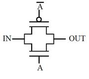

## SPICE

In the experiments we have done till now we have designed gates by arranging transistors in various fashions. The simulation of these designs gave graphs of output voltages and we analyzed how these graph changes with varying different parameters of the transistor. Now when you place a transistor on screen there is a back end code which tells a simulator what are the points to which the transistor's substrate, gate, drain, source are connected. The language in which this information is conveyed is spice.

**INTRODUCTION TO SPICE**

SPICE (Simulation Program with Integrated Circuit Emphasis) is a powerful program that is used in integrated circuit and board-level design to check the integrity of circuit designs and to predict circuit behavior. SPICE was originally developed at the Electronics Research Laboratory of the University of California, Berkeley (1975). Simulating the circuit with SPICE is the industry-standard way to verify circuit operation at the transistor level before committing to manufacturing an integrated circuit. In spice program, circuit elements (transistors, resistors, capacitors, etc) and their connections being translated into a text net list.

Several types of circuit analyses can be done using SPICE program. Here are the most important ones-

 - DC analysis: calculates the DC transfer curve.
 - Transient analysis: calculates the voltage and current as a function of time when a large signal is applied.
 - AC Analysis: calculates the output as a function of frequency. A bode plot is generated.
 - Noise analysis.
 - Sensitivity analysis.
 - Distortion analysis.
 - Fourier analysis: calculates and plots the frequency spectrum.
 - Monte Carlo Analysis

All analyses can be done at different temperatures. The default temperature is 300K.

## PASS TRANSISTOR

Transmission gates are used in digital circuits to pass or block particular signal from the components. In transmission gates, NMOS and PMOS are parallel connected to each other. Schematic representation of transmission gate and its circuit symbol are shown below.

In the **transmission gates** the input to the gate acts as the controlling input and depending on the value of control variable, the input at the source end of transistor appears at the drain end or in other words the control variable controls a transmission gate to which pass variables are applied. In figure shown above A is the control signal.

**Pass transistor logic is an efficient alternative to Complementary CMOS logic design because of following reasons:**

1. Decreased node capacitance

2. Reduced transistor count required to implement a logic function

3. Due to the low voltage swing pass transistors require lower switching energy to charge up the node

4. Better speed

5. Low power design

6. No static power consumption

**Applications of Transmission Gate :**

1. Transmission gates are typically used as building blocks for logic circuitry, such as a D Latch or D Flip-Flop

2. Transmission gates are basic building block for multiplexer

3. Transmission gates can be used for blocking particular component from live signal