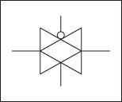
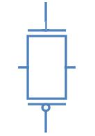
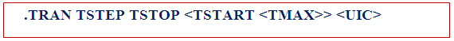
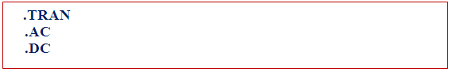
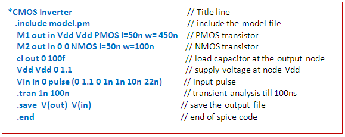

### 1. Pass Transistor Fundamentals

Transmission gates are used in digital circuits to pass or block particular signals from the components. In transmission gates, NMOS and PMOS are parallel connected to each other. Schematic representation of transmission gate and its circuit symbol are shown below.

In the **transmission gates** the input to the gate acts as the controlling input and depending on the value of control variable, the input at the source end of transistor appears at the drain end or in other words the control variable controls a transmission gate to which pass variables are applied. In figure shown above A is the control signal.

**Pass transistor logic is an efficient alternative to Complementary CMOS logic design because of following reasons:**

1. Decreased node capacitance
2. Reduced transistor count required to implement a logic function
3. Due to the low voltage swing pass transistors require lower switching energy to charge up the node
4. Better speed
5. Low power design
6. No static power consumption

**Applications of Transmission Gate:**

1. Transmission gates are typically used as building blocks for logic circuitry, such as a D Latch or D Flip-Flop
2. Transmission gates are basic building block for multiplexer
3. Transmission gates can be used for blocking particular component from live signal

### 2. Introduction to SPICE

In the experiments we have done till now we have designed gates by arranging transistors in various fashions. The simulation of these designs gave graphs of output voltages and we analyzed how these graphs change with varying different parameters of the transistor. Now when you place a transistor on screen there is a back end code which tells a simulator what are the points to which the transistor's substrate, gate, drain, source are connected. The language in which this information is conveyed is SPICE.

**WHAT IS SPICE?**

SPICE (Simulation Program with Integrated Circuit Emphasis) is a powerful program that is used in integrated circuit and board-level design to check the integrity of circuit designs and to predict circuit behavior. SPICE was originally developed at the Electronics Research Laboratory of the University of California, Berkeley (1975). Simulating the circuit with SPICE is the industry-standard way to verify circuit operation at the transistor level before committing to manufacturing an integrated circuit. In SPICE program, circuit elements (transistors, resistors, capacitors, etc) and their connections are translated into a text netlist.

Several types of circuit analyses can be done using SPICE program. Here are the most important ones:

- DC analysis: calculates the DC transfer curve.
- Transient analysis: calculates the voltage and current as a function of time when a large signal is applied.
- AC Analysis: calculates the output as a function of frequency. A bode plot is generated.
- Noise analysis.
- Sensitivity analysis.
- Distortion analysis.
- Fourier analysis: calculates and plots the frequency spectrum.
- Monte Carlo Analysis

All analyses can be done at different temperatures. The default temperature is 300K.

### 3. Pass Transistor Logic Implementation

Transmission gate is the parallel combination of NMOS and PMOS. When control signal (signal A) is high then transmission gate passes signal from input to output. NMOS passes good zero and PMOS passes good one, putting NMOS and PMOS in parallel produces a transmission gate that passes both logic levels well.

**PASS TRANSISTOR LOGIC THROUGH NMOS**

As we already know NMOS permits flow of current from source to drain when the input to the gate is 1 therefore when control variable is equal to 1 the input at the source end appears on the drain.

| IN  | CONTROL | OUT |
| --- | ------- | --- |
| 0   | 0       | X   |
| 1   | 0       | X   |
| 0   | 1       | 0   |
| 1   | 1       | 1   |

**PASS TRANSISTOR LOGIC THROUGH PMOS**

As we already know PMOS permits flow of current from source to drain when the input to the gate is 0 therefore when control variable is equal to 0 the input at the source end appears on the drain.

| IN  | CONTROL | OUT |
| --- | ------- | --- |
| 0   | 0       | 0   |
| 1   | 0       | 1   |
| 0   | 1       | X   |
| 1   | 1       | X   |

The above shown pass transistor will now be able to give a good one as well as good zero. At the time when S=1, both will be able to pass so whether the input signal is zero or one it will be passed almost as it is.

### 4. SPICE Syntax and Commands

A SPICE input file, also called source file, consists of three parts:

- **Data statements:** These statements are description of the components and their interconnections.

- **Control statements:** These statements are responsible to tell SPICE simulator what type of analysis to perform on the circuit.

- **Output statements:** These statements specify what outputs are to be printed or plotted.

Although these statements may appear in any order, it is recommended that they be given in the above sequence. Two other statements are required: the title statement and the end statement. The title statement is the first line and can contain any information, while the end statement is always .END. The title statement must be a line or word. In addition, you can insert comment statements, which must begin with an asterisk (\*) and are ignored by SPICE Simulator.

**1. Data Statements**

**(A) Independent DC Sources**

N1 is the positive terminal node. N2 is the negative terminal node. Type can be DC, AC or TRAN, depending on the type of analysis. Value gives the value of the source. The name of a voltage and current source must start with V and I, respectively.

The positive current direction through the current or voltage source is from the positive (N1) node to the negative (N2) node:

**(B) Elements: for example MOSFETs**

The MOS transistor name (Mname) has to start with a M; ND, NG, NS and NB are the node numbers of the Drain, Gate, Source and Bulk terminals, respectively. ModName is the name of the transistor model (NMOS or PMOS). L and W are the length and width of the gate (in m).

**2. Commands or Control Statements:**

**.TRAN Statement**

This statement specifies the time interval over which the transient analysis takes place, and the time increments. The format is as follows: TSTEP is the printing increment. TSTOP is the final time TSTART is the starting time (if omitted, TSTART is assumed to be zero) TMAX is the maximum step size. UIC stands for Use Initial Conditions. If UIC is specified then simulator will use the initial conditions specified in the element statements.

**3. Output Statements**

These statements will instruct Simulator what output to generate. If you do not specify an output statement, Simulator will always calculate the DC operating points. The two types of outputs are the prints and plots. A print is a table of data points and a plot is a graphical representation. The format is as follows:

In above format TYPE specifies the type of analysis to be printed or plotted and can be:

The output variables are Y1, Y2 and can be voltage or currents in voltage sources. Node voltages and device currents can be specified as magnitude (M), phase (P), real (R) or imaginary (I) parts by adding the suffix to V or I as follows:

- **M**: Magnitude.
- **DB**: Magnitude in dB (decibels).
- **P**: Phase.
- **R**: Real part.
- **I**: Imaginary part.

**Complete example (Inverter-Netlist):**

In introduction of this experiment we have seen what is SPICE actually. In first experiment we have designed inverter, so as we have read in introduction that whenever you place anything like transistor or capacitor etc., there is a code which is written at back end corresponding to the element placed on screen. So in this experiment we are going to learn what is that code which is written in the back end, that is, we learn how to write that code directly, that is, we will learn basic inverter designing using SPICE coding.

The following is the code for inverter in SPICE along with some explanation.

Now we will be learning actually what parameters are specified by each of the element in every line in detail

**SPICE NETLIST EXAMPLE - INVERTER CIRCUIT**

The following explains each line of a SPICE inverter netlist:

**FIRST LINE**

First line of SPICE code is always a comment. So this line is always ignored by SPICE. SPICE does not do any kind of processing on this line.

**INCLUDE LINE**

.include line includes the model file but you should confirm that your model file should be in your current directory in which you are working.

**DETAILED LINE-BY-LINE EXPLANATION:**

1. **.lib 'models25.txt'**

   - This line includes a library file named 'models25.txt.' The library file typically contains information about models for various components used in the circuit.

2. **mn1 OUT IN VSS VSS nmos l=0.24u w=0.72u**

   - Defines an NMOS transistor named 'mn1' with specific characteristics:
     - `mn1`: Instance name.
     - `OUT IN VSS VSS`: Connections for drain, gate, source, and bulk (substrate).
     - `nmos`: Specifies the transistor type.
     - `l=0.24u`: Sets the length of the transistor to 0.24 microns.
     - `w=0.72u`: Specifies the width of the transistor as 0.72 microns.

3. **mp1 OUT IN VDD VDD pmos l=0.24u w=0.72u**

   - Similar to the previous line but for a PMOS transistor:
     - `mp1`: Instance name.
     - `OUT IN VDD VDD`: Connections for drain, gate, source, and bulk.
     - `pmos`: Specifies the transistor type.
     - `l=0.24u`: Sets the length of the transistor to 0.24 microns.
     - `w=0.72u`: Specifies the width of the transistor as 0.72 microns.

4. **cLoad OUT VSS 50fF**

   - Defines a capacitor named 'cLoad':
     - `OUT VSS`: Connections for one terminal connected to OUT and the other to VSS.
     - `50fF`: Specifies the capacitance of the capacitor as 50 femtofarads.

5. **vVDD VDD 0 2.5**

   - Defines a voltage source named 'vVDD':
     - `VDD 0`: Connections for positive terminal to VDD and negative terminal to the reference node (0 volts).
     - `2.5`: Specifies the voltage value as 2.5 volts.

6. **vVSS VSS 0 0**

   - Defines a voltage source named 'vVSS':
     - `VSS 0`: Connections for positive terminal to VSS and negative terminal to the reference node (0 volts).
     - `0`: Specifies the voltage value as 0 volts.

7. **VIN IN 0 pulse(0 2.5 100ps 100ps 100ps 2ns 4ns)**

   - Defines a pulse voltage source named 'VIN':
     - `IN 0`: Connections for positive terminal to IN and negative terminal to the reference node (0 volts).
     - `pulse(0 2.5 100ps 100ps 100ps 2ns 4ns)`: Specifies the pulse characteristics:
       - `0 2.5`: Pulse amplitude from 0 to 2.5 volts.
       - `100ps`: Rise time.
       - `100ps`: Fall time.
       - `100ps`: Pulse width.
       - `2ns`: Period.
       - `4ns`: Delay.

8. **.dc VIN start=0 stop=2.5 step=0.01**

   - Specifies a DC sweep analysis of the voltage source 'VIN':
     - `start=0`: Starting voltage value.
     - `stop=2.5`: Ending voltage value.
     - `step=0.01`: Voltage step size.

9. **.tran 1ps 8ns**

   - Specifies a transient analysis with:
     - `1ps`: Time step of 1 picosecond.
     - `8ns`: Total simulation time of 8 nanoseconds.

10. **.option post**

    - Sets a post-processing option, which may include additional analysis or data extraction after the simulation. This line directs SPICE to make an output file.

11. **.end**
    - Marks the end of the SPICE code.
